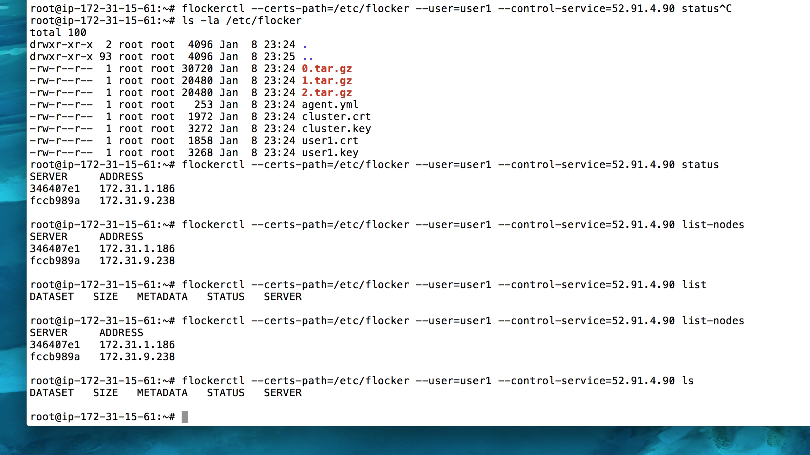

.. _cloudformation:

.. raw:: html

    

=========================================================
Installing Flocker with Swarm on AWS using CloudFormation
=========================================================

The steps in this guide enable you to quickly deploy a Flocker Swarm cluster, which uses four AWS EC2 instances.

.. figure:: ../images/cloudformation.png
    :scale: 95%
    :align: center
    :alt: A diagram illustrating a cluster of four AWS EC2 instances running Flocker with Docker Swarm.

    This diagram illustrates the cluster of four EC2 instances created by completing the CloudFormation steps below, and what each instance node in the cluster is running.

.. source material for this image: https://drive.google.com/open?id=0ByymF9bLBknGeXlPX1pTdXVZOGM

.. raw:: html
	
	

		

			<h2 class="step-stages__heading">Step 1</h2>
			
The AWS key pair uses public-key cryptography to provide secure login to your AWS cluster.

		

		

			
			Create and save an AWS EC2 Key Pair 
			
<a href="https://console.aws.amazon.com/ec2/v2/home?region=us-east-1">Create an AWS EC2 Key Pair</a> in the target region for Flocker cluster: 

		

		

			
			Create and save an AWS EC2 Key Pair 
			
<a href="https://console.aws.amazon.com/ec2/v2/home?region=us-east-1">Create an AWS EC2 Key Pair</a> in the target region for Flocker cluster: 

		

		

			
			Create and save an AWS EC2 Key Pair 
			
<a href="https://console.aws.amazon.com/ec2/v2/home?region=us-east-1">Create an AWS EC2 Key Pair</a> in the target region for Flocker cluster: 

		

	

	
	

		

			<h2 class="step-stages__heading">Step 2</h2>
			
Create a 2 node Flocker cluster:

			<a href="#" class="button">Create Cluster</a>
		

		

			
			Create and save an AWS EC2 Key Pair 
			
<a href="https://console.aws.amazon.com/ec2/v2/home?region=us-east-1">Create an AWS EC2 Key Pair</a> in the target region for Flocker cluster: 

		

		

			
			Create and save an AWS EC2 Key Pair 
			
<a href="https://console.aws.amazon.com/ec2/v2/home?region=us-east-1">Create an AWS EC2 Key Pair</a> in the target region for Flocker cluster: 

		

		

			
			Create and save an AWS EC2 Key Pair 
			
<a href="https://console.aws.amazon.com/ec2/v2/home?region=us-east-1">Create an AWS EC2 Key Pair</a> in the target region for Flocker cluster: 

		

	

	
	

		

			<h2 class="step-stages__heading">Step 3</h2>
			
Monitor stack completion message.

		

		

			
			Create and save an AWS EC2 Key Pair 
			
<a href="https://console.aws.amazon.com/ec2/v2/home?region=us-east-1">Create an AWS EC2 Key Pair</a> in the target region for Flocker cluster: 

		

		

			
			Create and save an AWS EC2 Key Pair 
			
<a href="https://console.aws.amazon.com/ec2/v2/home?region=us-east-1">Create an AWS EC2 Key Pair</a> in the target region for Flocker cluster: 

		

		

			
			Create and save an AWS EC2 Key Pair 
			
<a href="https://console.aws.amazon.com/ec2/v2/home?region=us-east-1">Create an AWS EC2 Key Pair</a> in the target region for Flocker cluster: 

		

	

	

Step 2
------

- Select Flocker CloudFormation stack launch Region (currently defaults to ``us-east-1``).

- Create a 2 node Flocker cluster:

.. TODO: customize CloudFormation link below to parameterize region.

.. raw:: html

  

      <a href="https://console.aws.amazon.com/cloudformation/home?region=us-east-1#/stacks/new?templateURL=https:%2F%2Fs3.amazonaws.com%2Finstaller.downloads.clusterhq.com%2Fflocker-cluster.cloudformation.json" class="button" target="_blank">Create Cluster</a>
  

.. TODO: Paramterize number of cluster nodes.
  
.. _CreateCluster:

- Fill in ``Stack name`` (any descriptive name), ``KeyName`` (corresponding to the key created in Step 1), ``AccessKeyID``, ``SecretAccessKey``.
  The last two are your AWS access credentials, get these from `here <https://console.aws.amazon.com/iam/home?nc2=h_m_sc#security_credential>`_.
  |parameters|

.. |parameters| image:: ../images/parameters.png

Step 3
------

- Monitor stack completion message |stack_completion|.

.. |stack_completion| image:: ../images/stack.png

Step 4
------

- Under ``Outputs`` tab, gather Client IP and Docker Swarm Host info:
  |client_swarmhost|

.. |client_swarmhost| image:: ../images/client-swarmhost.png

- Connect to the client IP, and check that ``docker info`` lists two hosts in the cluster:
  |swarm_status|

.. |swarm_status| image:: ../images/swarm-status.png

- Connect to the client IP, and check that ``flockerctl`` lists two nodes and zero datasets in the cluster:
  |flockerctl-status|

Your cluster is now ready for workloads!

Next steps
----------
.. TODO: make Try a tutorial link to the list of tutorials as soon as we have more than one

:ref:`Try a tutorial <tutorial-swarm-compose>` to kick the tyres on your Flocker cluster with Docker Swarm!
