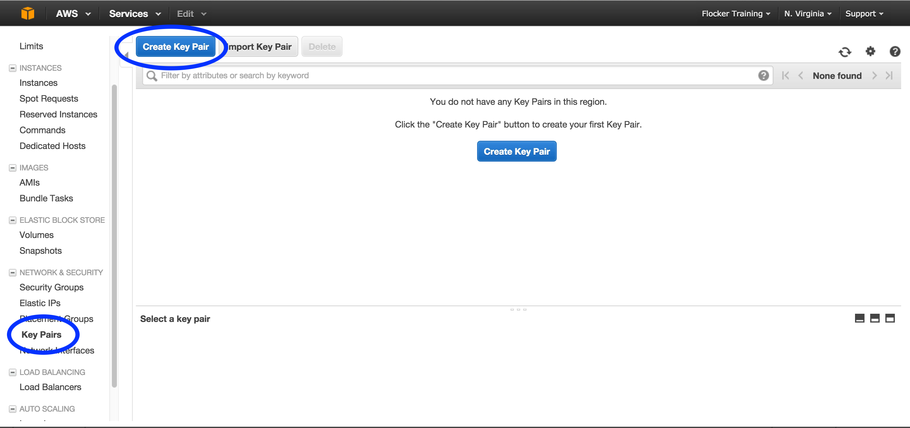
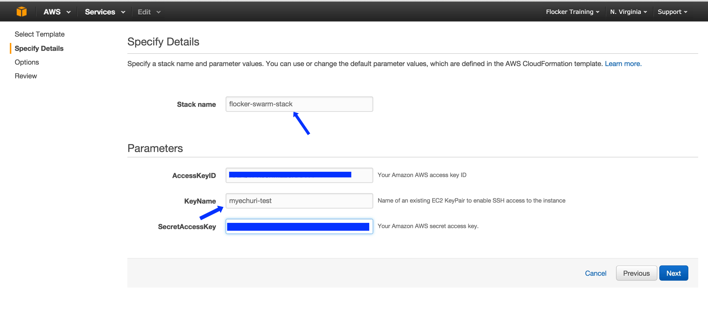
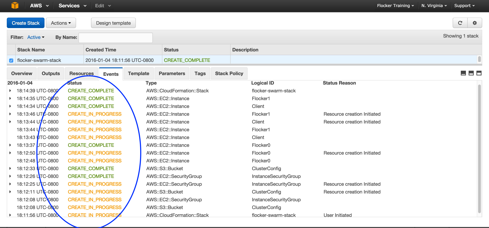
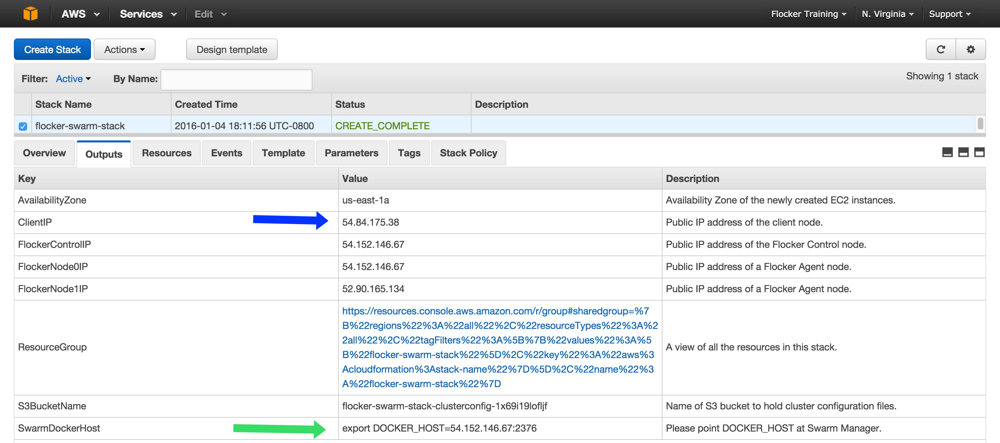
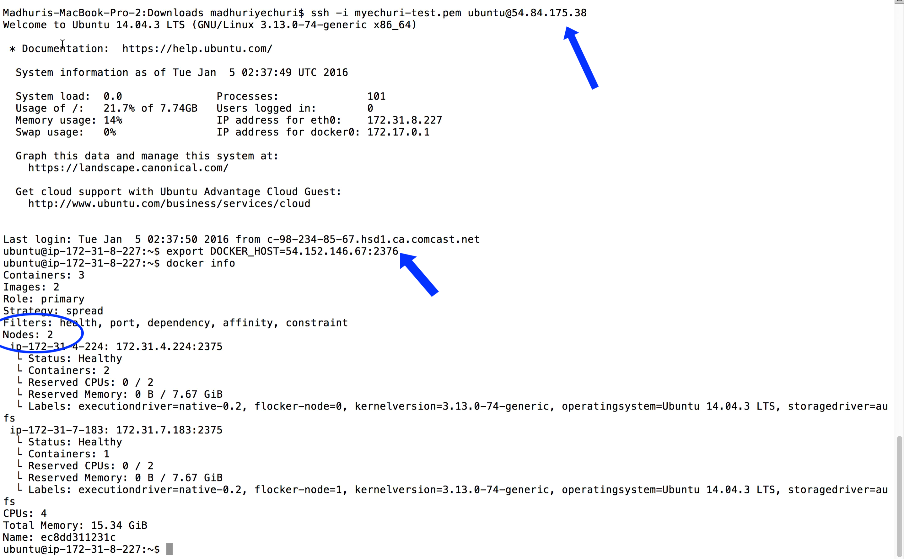

===============================================
Quick Installation of Flocker with Swarm on AWS
===============================================

Deployment Architecture
-----------------------

The below steps enable you to deploy a 2 node Flocker Swarm cluster with the following layout:
|cloudformation|

.. |cloudformation| image:: ../images/cloudformation.png

Step 1
------

Create and save an AWS EC2 Key Pair:

- Create an AWS EC2 Key Pair in the target region for Flocker cluster: https://console.aws.amazon.com/ec2/v2/home
  |keypair|

Step 2
------

- Select Flocker ClouldFormation stack launch Region (currently defaults to ``us-east-1``).

- Create a 2 node Flocker cluster CreateCluster_ .

.. TODO: Paramterize number of cluster nodes.
  
.. TODO: customize CloudFormation link below to parameterize region.
.. _CreateCluster: https://console.aws.amazon.com/cloudformation/home?region=us-east-1#/stacks/new?templateURL=https:%2F%2Fs3.amazonaws.com%2Finstaller.downloads.clusterhq.com%2Fflocker-cluster.cloudformation.json

- Fill in ``Stack name``, ``AccessKeyID``, ``KeyName`` (corresponding to the key created in Step 1), ``SecretAccessKey``.
  |parameters|

Step 3
------

- Monitor stack completion message |stack_completion|.

Step 4
------

- Under ``Outputs`` tab, gather Client IP and Docker Swarm Host info:
  |client_swarmhost|

- Connect to the client IP, and check that ``docker info`` lists two hosts in the cluster:
  |swarm_status|

Your cluster is now ready for workloads!
