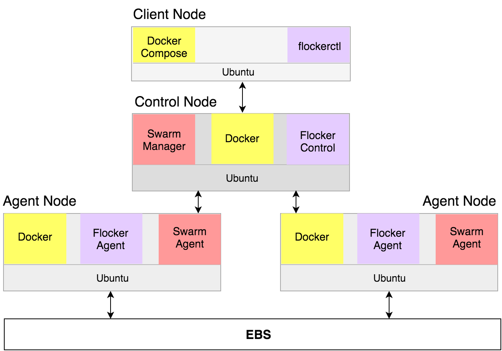

.. _cloudformation:

.. raw:: html

    

==================
Installing Flocker 
==================
---------------------------------------------
with Docker Swarm on AWS using CloudFormation
---------------------------------------------

In this guide you will learn how to quickly deploy a cluster of servers running Flocker and Docker Swarm.
You will launch four EC2 instances in your AWS account, as illustrated below:

.. raw:: html

	

.. raw:: html

	

Follow the steps below to create your cluster.
Once it's up and running we'll guide you through a tutorial to deploy a sample app.

.. source material for this image: https://drive.google.com/open?id=0ByymF9bLBknGeXlPX1pTdXVZOGM

.. raw:: html

	

		

			<h2 class="step-stages__heading">1</h2>
			<h3 class="step-stages__subheading">Create an AWS Key Pair</h3>
			
The AWS Key Pair allows you to login to your AWS cluster securely.

			

			<a href="https://console.aws.amazon.com/ec2/v2/home?region=us-east-1#KeyPairs:sort=keyName" class="button" target="_blank" align="middle">Log in to AWS</a>
			 
			This button will open AWS in a new window.

		

		

			
            When you have logged in to the AWS console, select your region. This should be the same region where you will create your cluster.
		

		

			
            Click "Create Key Pair". Give your key pair a meaningful name, like <strong><i>&lt;username&gt;</i>-flocker-test</strong>. You'll need this later, so <strong>make a note of it</strong>.
		

		

			
            The private key (.pem file) will be downloaded onto your computer.
		

	

	

		

			<h2 class="step-stages__heading">2</h2>
			<h3 class="step-stages__subheading">Create a Flocker cluster</h3>
			

             
			<a href="https://console.aws.amazon.com/cloudformation/home?region=us-east-1#/stacks/new?templateURL=https:%2F%2Fs3.amazonaws.com%2Finstaller.downloads.clusterhq.com%2Fflocker-cluster.cloudformation.json" class="button" target="_blank" align="middle">Start CloudFormation Configuration Process</a>
             
			This button will open CloudFormation in a new window.

		

		

            
			Click "Next" to proceed past the first page.

		

		

			
			
            <ul>
                <li>
                    Enter a <code>Stack name</code>. This can be any descriptive name.
                </li>
                <li>
                    Enter your <code>KeyPair</code> name from Step 1. Then enter your AWS <code>AccessKeyID</code> and <code>SecretAccessKey</code> credentials.
                </li>
            </ul>
            <a href="javascript:void(0);" onclick="$('#iam-instructions').show();">Don't know your AWS credentials?</a>
            
            

                You can generate new credentials on your <a href="https://console.aws.amazon.com/iam/home#users" target="_blank">IAM Users</a> page:
                <ul><li>Click on your user and go to the "Security Credentials" tab.</li><li>Click "Create Access Key".</li><li>Click "Show User Security Credentials".</li></ul>

            

		

		

		    
            
            <ul>
            <li>
                Now add your Volume Hub Token (optional). Volume Hub lets you see your Flocker cluster in a web interface. Create a free Volume Hub account:
                 
                 
                <a href="https://volumehub.clusterhq.com/" target="_blank" class="button" style="margin-top:1em; margin-bottom:1em;">Volume Hub</a>
                 
                 
            </li>
            <li>
                Once you're logged in to the Volume Hub, click below to get your Volume Hub Token:
                 
                 
                <a href="https://volumehub.clusterhq.com/v1/token" target="_blank" class="button">Volume Hub token</a>
                 
                 
                Then copy the <code>&lt;YourToken&gt;</code> part from <code>{"token": "&lt;YourToken&gt;"}</code> into the <code>VolumeHubToken</code> field.
             </li>
             </ul>
             

		

        

		

			
            
                <ul>
                    <li>
                        Click "Next" on the Options page.
                    </li>
                    <li>
                        Click "Next" on the Review page.
                    </li>
                    <li>
                        Finally, click "Create" to create your cluster.
                    </li>
                </ul>
            
        

	

	

		

			
			<h3 class="step-stages__subheading">Wait for the Cluster to Boot</h3>
			
It will take 5-10 minutes for the cluster servers to boot and to configure the Flocker and Docker Swarm services on each server.

		

		

			
			The stack may not appear immediately. Click the "Refresh" button until the new stack appears.
		

		

			
			Once the stack appears its status will be "CREATE_IN_PROGRESS".
		

		

			
			After 5-10 minutes the cluster will be ready for use and its status will be "CREATE_COMPLETE".
			The cluster is now ready.
		

	

	

		

			<h2 class="step-stages__heading">3</h2>
			<h3 class="step-stages__subheading">Verify your installation</h3>
            

                
Click on the "Outputs" tab for your stack. The values displayed on this tab will be used for verifying your installation and also any tutorials you go through.

                
                
Now open a Terminal window, and run the following commands to log in and verify your cluster is working.

                
Where a command includes a string like <code>&lt;ClientNodeIP&gt;</code>, use the corresponding value from the Outputs tab.

                
Where a command has <code>&lt;KeyPath&gt;</code> use the path on your machine to the <code>.pem</code> file you downloaded in Step 1, for example: <code>~/Downloads/<i>&lt;username&gt;</i>-flocker-test.pem</code>.

                

.. prompt:: bash

   chmod 0600 <KeyPath>
   ssh -i <KeyPath> ubuntu@<ClientNodeIP> # enter "yes" if prompted
   export FLOCKER_CERTS_PATH=/etc/flocker
   export FLOCKER_USER=user1
   export FLOCKER_CONTROL_SERVICE=<ControlNodeIP> # not ClientNodeIP!
   flockerctl status # should list two servers (nodes) running
   flockerctl ls # should display no datasets yet
   export DOCKER_TLS_VERIFY=1
   export DOCKER_HOST=tcp://<ControlNodeIP>:2376
   docker info |grep Nodes # should output "Nodes: 2"
   exit

.. raw:: html

                

                
If the commands succeeded, then your Flocker and Docker Swarm cluster is up and running.

                
You can also verify that your cluster has shown up in the Volume Hub:
                 
                 
                <a href="https://volumehub.clusterhq.com/" target="_blank" class="button" style="margin-top:1em; margin-bottom:1em; text-align:center;">Volume Hub</a>
                 
                
It should look like this:

                
            

		

	

	

		

			<h2 class="step-stages__heading">That's it!</h2>
			
Your cluster is now ready. Now try a tutorial.

			<a href="tutorial-swarm-compose.html" class="button">Deploy an app on your Swarm/Flocker cluster</a>
		

    

.. raw:: html

   

.. image:: /images/installer-swarm-compose/01-keys-menu.png
.. image:: /images/installer-swarm-compose/02-create-key.png
.. image:: /images/installer-swarm-compose/03-pem-downloaded.png
.. image:: /images/installer-swarm-compose/10-cloudformation-firstpage.png
.. image:: /images/installer-swarm-compose/11-cloudformation-stackname.png
.. image:: /images/installer-swarm-compose/12-cloudformation-settings.png
.. image:: /images/installer-swarm-compose/13-cloudformation-create.png
.. image:: /images/installer-swarm-compose/21-refresh.png
.. image:: /images/installer-swarm-compose/22-create-in-progress.png
.. image:: /images/installer-swarm-compose/23-create-complete.png
.. image:: /images/installer-swarm-compose/31-stack-outputs.png
.. image:: /images/installer-swarm-compose/32-volume-hub-verification.png
.. image:: /images/kettle.png

.. raw:: html

   

