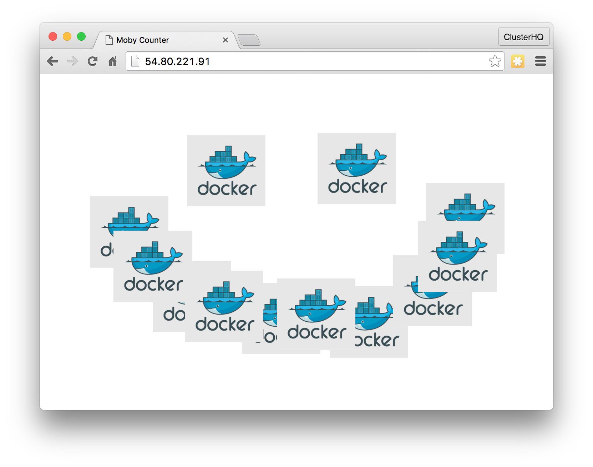

.. _tutorial-swarm-compose:

===================================================
Tutorial: Using Flocker with Docker, Swarm, Compose
===================================================

For this tutorial, we've provided a simple app for you to deploy, made up of two containers:

* A Node.js application called ``moby-counter``.
  This app allows you to put Docker icons anywhere on your screen, and the locations are stored in a database.
* A PostgreSQL database for the application, which is stateful, and needs a Flocker volume.

You will use Docker Compose to deploy the app on a Swarm cluster using Flocker as a volume driver.

You will then move both containers from one node to another by changing the Swarm constraints in the Docker Compose file and re-deploying.
The app will keep its data!

What You'll Need
================

* A Flocker cluster with Swarm installed.

  * Use one of our :ref:`Flocker with Swarm installation options <docker-integration>` to get one.

* A Client machine with Docker Compose and access to the Swarm master.

  * If you used the :ref:`CloudFormation installer <cloudformation>`:

    * The Client EC2 instance is preconfigured with Docker Compose.
      Use the following command to ssh in:

      .. prompt:: bash $

          ssh -i <KeyPath> ubuntu@<ClientNodeIP>

    * ``<KeyPath>`` is the path on your machine to the ``.pem`` file you downloaded from AWS, for example: ``~/Downloads/flocker-test.pem``.

    * You will need ``<ClientNodeIP>``, ``<ControlNodeIP>``, ``<AgentNode1IP>`` and ``<AgentNode2IP>`` from the CloudFormation Outputs tab.

    * The rest of this tutorial will assume you are logged into the Client instance.

  * If you did not use the CloudFormation installer:

    * Install `Docker Compose <https://docs.docker.com/compose/install/>`_ on any machine which has network access to the Swarm master that you created when you installed Swarm manually.

    * The rest of this tutorial will assume you are logged into the machine you installed Compose on.

Step 1: Set ``DOCKER_HOST``
===========================

Compose uses the environment variable ``DOCKER_HOST`` to know how to talk to the Swarm master.
If you used the :ref:`CloudFormation installer <cloudformation>`, it is listed in the Outputs tab of your CloudFormation stack.

Use the following commands to set the ``DOCKER_TLS_VERIFY`` and ``DOCKER_HOST`` environment variables:

.. prompt:: bash $

   export DOCKER_TLS_VERIFY=1
   export DOCKER_HOST=tcp://<ControlNodeIP>:2376

``<ControlNodeIP>`` is the IP address of your Swarm master.

Step 2: Deploy the app on the first node
========================================

The two Docker Compose files below need to be saved on your Client machine, in a directory named :file:`swarm-compose-tutorial`.

:download:`tutorial-downloads/flocker-swarm-tutorial-node1.yml`

:download:`tutorial-downloads/flocker-swarm-tutorial-node2.yml`

You can either click the cloud icons to save the files locally, and then move them onto your Client machine using using a transfer medium such as ``scp``, or right click each file, and copy the link address and run the following commands with the tutorial URLs:

.. prompt:: bash $

    mkdir swarm-compose-tutorial
    cd swarm-compose-tutorial
    wget <Tutorial1Url>
    wget <Tutorial2Url>

.. TODO: It would be much nicer if we had a Sphinx directive to output the URL of a download, so the user didn't have to right click and copy-paste here.

The Docker Compose files both have the same layout, as illustrated below, except the ``node2`` file has ``constraint:flocker-node==2`` instead of ``constraint:flocker-node==1``.

.. literalinclude:: tutorial-downloads/flocker-swarm-tutorial-node1.yml
   :language: yaml

* The ``moby-counter`` app container is exposed on port 80.
* The app is configured with the same database credentials as the database.
* The ``postgres`` container uses a ``volume_driver`` of ``flocker`` and uses a named Flocker volume called ``postgres``.

  * Flocker will automatically provision this volume on-demand if it doesn't already exist.

Now deploy the app by running:

.. prompt:: bash $

   docker-compose -f flocker-swarm-tutorial-node1.yml up -d

.. note:: At this point in the `Volume Hub <https://volumehub.clusterhq.com>`_ and you should be able to see the volume in use by the ``postgres`` container.

Open ``<AgentNode1IP>`` in a browser, and click around to add some Docker logos on the screen.
For example:

The locations of the logos get stored (persisted) in the PostgreSQL database, and saved to the Flocker volume.

Step 3: Move the app
====================

Now we will demonstrate stopping the app on one machine and starting it on the other.

.. prompt:: bash $

   docker-compose -f flocker-swarm-tutorial-node1.yml down
   docker-compose -f flocker-swarm-tutorial-node2.yml up -d

Note that we are destroying the first set of containers and then starting the second compose file which has the constraint to force Swarm to schedule the containers onto the second node.

Flocker will detach and attach the storage so that the container starts up with the expected data.

.. note:: At this point in the `Volume Hub <https://volumehub.clusterhq.com>`_ you should be able to see the volume being moved from node 1 to node 2 and the new container being started up.

Open ``<AgentNode2IP>`` in a browser, and you'll be able to see that your data has persisted!
For example:

Cleaning up
===========

To clean up the containers and Docker's references to the volumes, run:

.. prompt:: bash $

   docker-compose -f flocker-swarm-tutorial-node2.yml down
   docker volume rm postgres

To actually delete the volumes, we need to use ``flockerctl``.
For more information, see :ref:`about-docker-integration` and :ref:`flockerctl`.

.. prompt:: bash $

   unset DOCKER_HOST
   unset DOCKER_TLS_VERIFY
   export FLOCKER_CERTS_PATH=/etc/flocker
   export FLOCKER_USER=user1
   export FLOCKER_CONTROL_SERVICE=<ControlNodeIP>
   flockerctl ls
   flockerctl destroy -d <DatasetID> # use <DatasetID> from output above

Note that this will destroy the ``postgres`` volume and all the data in it.

Next steps
==========

Now try deploying your own Docker Compose app!

* Set ``volume_driver: flocker`` for any stateful containers you have.
* Specify the Flocker volumes using ``"flocker_volume_name:/path_inside_container"`` syntax for one or more of the list elements under the ``volumes`` key.

.. XXX add the following sentence when more Docker tutorials are written:
   Or, try one of our other :ref:`Docker Tutorials <docker-tutorials>`.

.. note::  Because we do not have a networking solution in this example, we use Swarm constraints to force both containers to be on the same node each time we deploy them so that regular Docker links work.
