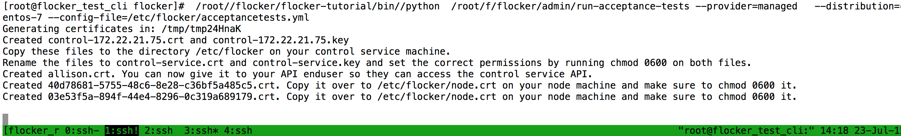

.. _build-flocker-driver-faq:

===
FAQ
===

.. contents::
    :local:
    :backlinks: none

Please read through the following frequently asked questions encountered when building and troubleshooting your driver.

Driver Development FAQ
======================

Is dataset_id unique for each volume created?
---------------------------------------------

Yes.

Is there some way to get the dataset_id from flocker given the blockdevice_id  specific to our driver?
------------------------------------------------------------------------------------------------------
No.

Does Flocker node agent cache any state?
----------------------------------------

No. The only state cached is in Flocker control agent.

After running functional tests, I see a lot of volumes leftover from test run. Is there a script to clean them up?
------------------------------------------------------------------------------------------------------------------

After each test case, `detach_destroy_volumes <https://github.com/ClusterHQ/flocker/blob/master/flocker/node/agents/test/test_blockdevice.py#L209>`_ is run automatically to cleanup volumes created by the test case. This cleanup call is added as part of `get_blockdeviceapi_with_cleanup <https://github.com/ClusterHQ/flocker/blob/master/flocker/node/agents/test/blockdevicefactory.py#L265>`_ .

Please use ``get_blockdeviceapi_with_cleanup`` in your test wrapper.

Do you have an easy way to view the logs?  I get a lot of output in journactl and it’s very difficult to track what all is happening.
-------------------------------------------------------------------------------------------------------------------------------------

Eliot-tree is the preferred way, but does not work at the moment due to `a bug <https://github.com/jonathanj/eliottree/issues/28>`_ . 

Troubleshooting FAQ
===================

My functional test failed. How do i go about debugging?
-------------------------------------------------------

Start with Flocker node agent log (`/var/log/flocker/flocker-dataset-agent.log`). You can use `eliot-tree <https://github.com/jonathanj/eliottree>`_ to render the log in ASCII format. 

If the Flocker log looks ok, move on to storage driver log, then storage backend logs.

I see the following error in Flocker dataset agent log. How do i triage further?
--------------------------------------------------------------------------------

.. code-block:: bash

	Command '['mount', '/dev/sdb', '/flocker/c39e7d1c-7c9e-6029-4c30-42ab8b44a991']' returned non-zero exit status 32

Please run the failed command from command line prompt - the cause of failure is most likely environment related (incomplete attach/detach operation preceeding the command), and not caused by bug in Flocker or Flocker Storage driver.

I see the following error while running acceptance tests:
---------------------------------------------------------

Please check that you have configured Flocker CA certs as documented `here <https://docs.clusterhq.com/en/1.3.0/config/configuring-authentication.html>`_ .

My test environment is messed up, and i’d like to reset Flocker control service state. How do i do that?
--------------------------------------------------------------------------------------------------------

Flocker control state is stored in `/var/lib/flocker/current_configuration.v1.json` on control compute node.
You can edit/remove the file to reduce/cleanup control service state:

.. code-block:: bash

	systemctl stop flocker-control
	rm /var/lib/flocker/current_configuration.v1.json
	systemctl start flocker-control/
