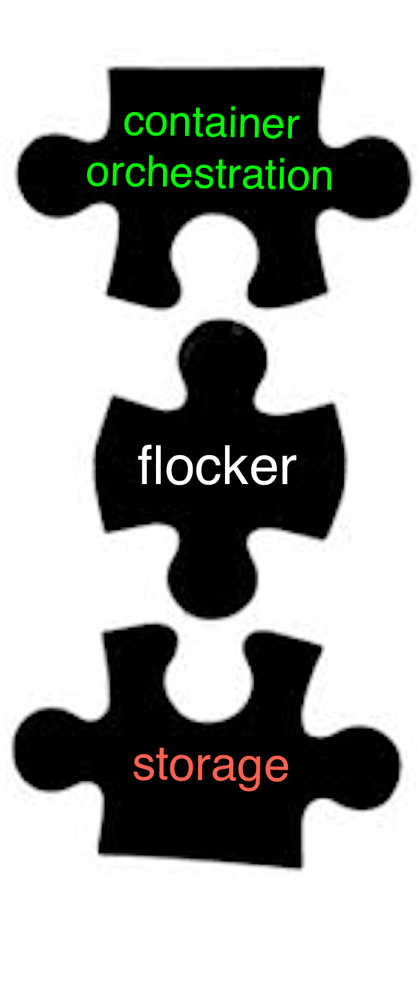

.. raw:: html

    <!-- This toctree-wrapper and next button override is obviously a horrible
         hack, and we need a better way of disabling the toctree on the front
         page. -->
    

.. raw:: html

   

.. raw:: html

   

How to include Flocker in your Container Stack
==============================================

**Flocker integrates container orchestration frameworks with storage systems.**

This means you can run *stateful containers* like *databases* in production and have the volumes follow the containers around as they get moved or rescheduled.

Flocker is filesystem-based, so it works with any container image that stores its data in a volume.

.. raw:: html

   

==================================
Supported Orchestration Frameworks
==================================

.. raw:: html

    <!-- This too needs to become Sphinx directives, rather than raw HTML. -->
    

        Docker Engine, Swarm and/or Compose
    

    

        Kubernetes
    

    

        Mesos
    

    

        Flocker Standalone
    

    

=================
Supported Storage
=================

.. raw:: html

    <!-- This too needs to become Sphinx directives, rather than raw HTML. -->
    

        AWS - EBS
    

    

        GCE - PD
    

    

        OpenStack - Cinder
    

    

        vSphere - vSphere
    

    

        Storage hardware e.g. Dell, EMC, NetApp (SAN) <link>
    

    

        Storage software e.g. Ceph, ScaleIO (SDS) <link>
    

    

===========================
Supported Operating Systems
===========================

.. raw:: html

    <!-- This too needs to become Sphinx directives, rather than raw HTML. -->
    

        Ubuntu LTS
    

    

        CentOS 7
    

    

        RHEL 7 (coming soon)
    

    

        CoreOS (beta)
    

    

.. toctree::
   :maxdepth: 2

   introduction/index
   docker-integration/index
   kubernetes-integration/index
   mesos-integration/index
   flocker-standalone/index
   labs/index
   releasenotes/index
   faq/index
   gettinginvolved/index

.. The version page is used only for a version of the documentation to know what the latest version is.

.. toctree::
   :hidden:

   version
