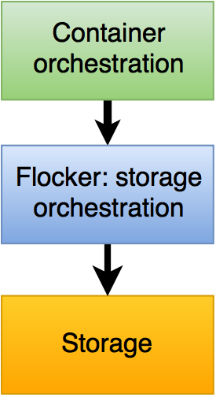

.. raw:: html

    <!-- This toctree-wrapper and next button override is obviously a horrible
         hack, and we need a better way of disabling the toctree on the front
         page. -->
    

.. raw:: html

   

.. raw:: html

   

.. what follows is a terrible hack to force sphinx to drag images into the build

.. raw:: html

   

.. image:: images/AWS.png
.. image:: images/GCE.png

.. image:: images/hedvig.png

.. raw:: html

   

==============================================
How to include Flocker in your Container Stack
==============================================

**Flocker integrates container orchestration frameworks with storage systems.**

This means you can run *stateful containers* like *databases* in production and have the volumes follow the containers around as they get moved or rescheduled.

Flocker is filesystem-based, so it works with any container image that stores its data in a volume.

.. raw:: html

   

.. _supported-orchestration-frameworks:

Supported Orchestration Frameworks
==================================

.. raw:: html

    <!-- This too needs to become Sphinx directives, rather than raw HTML. -->
    

	    Docker, Swarm, Compose
		
		 
	<a href="docker-integration/" class="button" style="position:relative; top: 2em">Deploy</a>
    

    

		Kubernetes
		
         
	<a href="kubernetes-integration/" class="button" style="position:relative; top: 2em">Deploy</a>
    

    

		Mesos
		
         
	<a href="mesos-integration/" class="button" style="position:relative; top: 2em">Deploy</a>
    

    

		Other
	 	
         
	<a href="flocker-standalone/" class="button" style="position:relative; top: 2em">Deploy</a>
    

    

.. _storage-backends:

Supported Storage
=================

**IaaS block storage**

.. raw:: html

    <!-- This too needs to become Sphinx directives, rather than raw HTML. -->
    

        AWS - EBS
		
    

    

        GCE - PD
		
		(coming soon)
    

    

        OpenStack - Cinder
		
    

    

        VMware vSphere
		
		 
    

    

**Software defined storage**

.. raw:: html

    <!-- This too needs to become Sphinx directives, rather than raw HTML. -->
    

        Ceph 
		
		(coming soon)
		(experimental)
    

    

        EMC ScaleIO
		
		(3rd party)
    

    

        Hedvig
		
		(3rd party)
    

    

        NexentaEdge
		
		(3rd party)
    

    

        ConvergeIO
		
		(3rd party)
    

    

**Hardware devices**

.. raw:: html

    <!-- This too needs to become Sphinx directives, rather than raw HTML. -->
    

        Dell SC Series
		
		(3rd party)
    

    

        EMC XtremIO
		
		(3rd party)
    

    

        NetApp OnTap
		
		(3rd party)
    

    

        Saratoga Speed
		
		(3rd party)
    

    

        Huawei
		
		(3rd party)
    

    

    

     = Community developed (3rd party)
     = Experimental
     = Coming soon
    

.. XXX This link probably needs to go somewhere, but not here: Configuration details for each of the backends can be found in the :ref:`Configuring the Nodes and Storage Backends<agent-yml>` topic.

.. note:: If you wish to use a storage device that is not supported by Flocker or an existing plugin, you can implement this support yourself.
          For more information, see :ref:`contribute-flocker-driver`.

.. _supported-operating-systems:

Supported Operating Systems
===========================

.. raw:: html

    <!-- This too needs to become Sphinx directives, rather than raw HTML. -->
    

        Ubuntu LTS
		
    

    

        CentOS 7
		
    

    

        RHEL 7
		
		(coming soon)
    

    

        CoreOS
		
		(beta)
    

    

.. toctree::
   :maxdepth: 2

   index
   docker-integration/index
   kubernetes-integration/index
   mesos-integration/index
   flocker-standalone/index
   labs/index
   releasenotes/index
   faq/index
   gettinginvolved/index

.. The version page is used only for a version of the documentation to know what the latest version is.

.. toctree::
   :hidden:

   version
