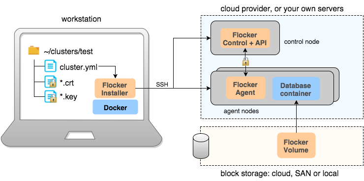

.. Single Source Instructions

==================
Installing Flocker
==================

.. begin-body-quick-start-installer

Quick Start Flocker Installer
=============================

Use the Flocker Installer if you want to get started with Flocker quickly, but in your own environment.

.. note:: 
   The Installer is one of our Labs projects, so is currently experimental.
   Because Installer is still experimental, it is currently only available for Ubuntu 14.04 on AWS with an EBS backend.
   Other configurations (for example, CentOS or OpenStack) are possible via the full installation docs.
   
   If you get an error response from any of the commands in this guide, please `report a bug <https://github.com/clusterhq/unofficial-flocker-tools/issues>`_, pasting the ``install-log.txt`` file you will find in the current directory.

The following diagram illustrates the architecture for the Installer:

.. Source file is at "Engineering/Labs/flocker architecture" https://drive.google.com/open?id=0B3gop2KayxkVbmNBR2Jrbk0zYmM

* The Installer runs in a Docker container on your local machine.
* You give the Installer your cloud infrastructure credentials.
* The Installer provisions servers for you, and it writes a ``cluster.yml`` in your cluster directory containing the addresses of the servers.
* You run the Installer on the ``cluster.yml``.
* The Installer creates certificates for you, saves them in your cluster directory, installs Flocker and the certificates on servers, and starts Flocker.
* You can now interact with your Flocker cluster using the ``docker`` CLI on the nodes, or locally by using the ``uft-flocker-deploy`` tool or the ``uft-flocker-volumes`` tool.

The following instructions will take you through installing Flocker with the Installer, and running a tutorial to check everything is working:

.. toctree::
   :maxdepth: 1
   
   ../installation/installer
   ../installation/installer-getstarted
   ../installation/installer-tutorial
   ../installation/cluster-cleanup

.. end-body-quick-start-installer

.. begin-body-full-installation

Installing Flocker
==================

To get the full Flocker functionality, the following installation steps will take you through installing the Flocker client and the Flocker node services.

.. XXX this introduction could be improved with an image. See FLOC-2077

.. note:: If you're interested in developing Flocker (as opposed to simply using it) see :ref:`contribute`.

.. end-body-full-installation

.. toctree::
   :maxdepth: 2

   ../installation/install-client
   ../installation/install-node

.. toctree::
   :hidden:

   ../installation/setup-aws
   ../installation/setup-rackspace

.. begin-body-configuring-flocker

Configuring Flocker
===================

Once you have installed Flocker you will need to complete the following configuration steps in order to start using your cluster:

.. end-body-configuring-flocker

.. toctree::
   :maxdepth: 2

   ../installation/configuring-authentication
   ../installation/generate-api-certificates
   ../installation/enabling-control-service
   ../installation/configuring-nodes-storage
   ../installation/enabling-agent-service

.. begin-body-controlling-flocker

Controlling Flocker
===================

You can control Flocker in a number of ways.
Find out which way is best for you.

Flocker lives on your nodes alongside Docker.
Each node where Docker is installed will have a Flocker agent as well.
The Flocker agents are controlled by the Flocker control service which is installed on just one node (usually a dedicated node).
The Flocker control service is controlled via API endpoints, either directly or indirectly.

You can control Flocker in the following ways:

* Using the Docker command line tools, via the Flocker plugin for Docker.
* Using the Flocker command line tools.
* Using the :ref:`Flocker API <api>` directly.

The following topics go into more detail about how you can control Flocker using the Flocker plugin for Docker, how you can use the Flocker CLI, and further information about how to administer Flocker:

.. toctree::
   :maxdepth: 2

   ../installation/plugin/index
   ../installation/cli/index
   ../installation/administering/index

.. end-body-controlling-flocker
