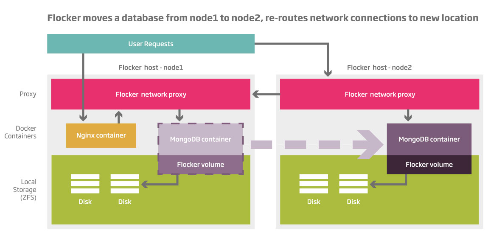

=======================
Introduction to Flocker
=======================

Motivation for Building Flocker
===============================
Flocker lets you move your Docker containers and their data together between Linux hosts.
This means that you can run your databases, queues and key-value stores in Docker and move them around as easily as the rest of your app.
Even stateless apps depend on many stateful services and currently running these services in Docker containers in production is nearly impossible.
Flocker aims to solve this problem by providing an orchestration framework that allows you to port both your stateful and stateless containers between environments.

Docker allows for multiple isolated, reproducible application environments on a single node: "containers".
Application state can be stored on a local disk in "volumes" attached to containers.
And containers can talk to each other and the external world via specified ports.

But what happens if you have more than one node?

* Where do containers run?
* How do you talk to the container you care about?
* How do containers across multiple nodes talk to each other?
* How does application state work if you move containers around?
  
The diagram below provides a high level representation of how Flocker addresses these questions.

         Flocker's proxying layer allows you to communicate with containers by routing traffic to any node.
         Filesystem state gets moved around with ZFS.

Architecture
============

Below is a high-level overview of Flocker's architecture.  
For more information, you can follow along with a :doc:`tutorial that walks you through deploying and migrating MongoDB</indepth/tutorial/index>` or read more in our :doc:`advanced documentation</advanced/index>`.

Flocker - Orchestration
-----------------------

* Flocker can run multiple containers on multiple nodes.
* Flocker offers a configuration language to specify what to run and where to run it.

Flocker - Routing
-----------------

* Container configuration includes externally visible TCP port numbers.
* Connect to any node on a Flocker cluster and traffic is routed to the node hosting the appropriate container (based on port).
* Your external domain (``www.example.com``) configured to point at all nodes in the Flocker cluster (``192.0.2.0``, ``192.0.2.1``)

Flocker - Application State
---------------------------

* Flocker manages ZFS filesystems as Docker volumes.  It attaches them to your containers.
* Flocker provides tools for copying those volumes between nodes.
* If an application container is moved from one node to another, Flocker automatically moves the volume with it.

Application Configuration
-------------------------

* Application configuration describes what you want to run in a container.

  * it identifies a Docker image
  * an optional volume mount point
  * externally "routed" ports

* This configuration is expected to be shared between development, staging, production, etc environments.
* Flocker 0.1 does not support automatic re-deployment of application configuration changes.

Deployment Configuration
------------------------

* Deployment configuration describes how you want your containers deployed.

  * which nodes run which containers.

* This configuration can vary between development, staging, production, etc environments.

  * Developer might want to deploy all of the containers on their laptop.
  * Production might put database on one node, web server on another node, etc.

* Reacting to changes to this configuration is the primary focus of Flocker 0.1.

Initial Implementation Strategy
===============================

* This is the 0.1 approach.
* Future approaches will be very different; feedback is welcome.
* All functionality is provided as short-lived, manually invoked processes.
* ``flocker-deploy`` connects to each node over SSH and runs ``flocker-reportstate`` to gather the cluster state.
* ``flocker-deploy`` then connects to each node over SSH and runs ``flocker-changestate`` to make the necessary deployment changes.
* Nodes might connect to each other over SSH to copy volume data to the necessary place.

``flocker-changestate``
-----------------------

* This is installed on nodes participating in the Flocker cluster.
* Accepts the desired global configuration and current global state.
* Also looks at local state - running containers, configured network proxies, etc.
* Makes changes to local state so that it complies with the desired global configuration.

  * Start or stop containers.
  * Push volume data to other nodes.
  * Add or remove routing configuration.

Managing Volumes
----------------

* Volumes are ZFS filesystems.
* Volumes are attached to a Docker "data" container.
* Flocker automatically associates the "data" container's volumes with the actual container.

  * Association is done based on container names.

* Data model

  * Volumes are owned by a specific node.

  * Node A can push a copy to node B but node A still owns the volume.
    Node B may not modify its copy.

  * Volumes can be "handed off" to another node, i.e. ownership is changed.
    Node A can hand off the volume to node B.
    Then node B is now the owner and can modify the volume and node A no longer can.

* Volumes are pushed and handed off so as to follow the containers they are associated with.

  * This happens automatically when ``flocker-deploy`` runs with a new deployment configuration.

Managing Routes
---------------

* Containers claim TCP port numbers with the application configuration that defines them.
* Connections to that TCP port on the node that is running the container are proxied (NAT'd) into the container for whatever software is listening for them there.
* Connections to that TCP port on any other node in the Flocker cluster are proxied (NAT'd) to the node that is running the container.
* Proxying is done using ``iptables``.

User Experience
===============

* Flocker provides a command-line interface for manually deploying or re-deploying containers across nodes.
* The tool operates on two distinct pieces of configuration:

  * Application
  * Deployment

* Your sysadmin runs a command like ``flocker-deploy deployment-config.yml application-config.yml`` on their laptop.
