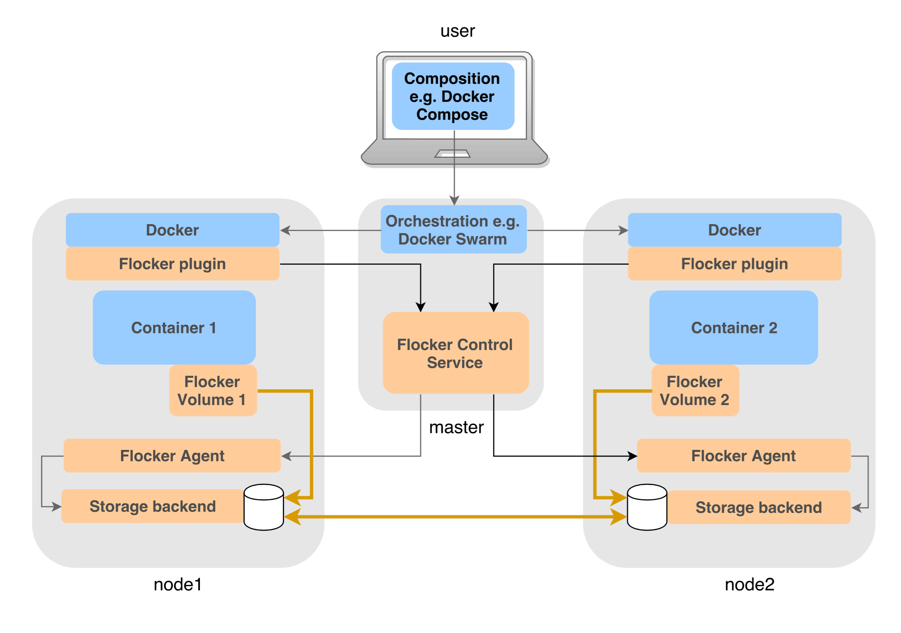

.. _labs-docker-plugin:

=====================
Flocker Docker plugin
=====================

The Flocker Docker plugin is a `Docker volumes plugin`_, connecting Docker on a host directly to Flocker, where Flocker agents will be running on the same host and hooked up to the Flocker control service.

This diagram explains how the architecture of a Flocker cluster with the Docker plugin would look if the user is also using :ref:`Docker Swarm <labs-swarm>` and :ref:`Docker Compose <labs-compose>`:

.. The source file for this diagram is in Engineering/Labs folder on GDrive: https://drive.google.com/open?id=0B3gop2KayxkVc1g3R1AyQzFNODQ

Note that in contrast to the normal :ref:`Flocker container-centric architecture <flocker-containers-architecture>`, in this architecture, the Flocker volume manager (control service + dataset agents) is **being controlled by Docker**, rather than Flocker container manager controlling Docker.
This allows for easier integration with other Docker ecosystem tools.

Also note that, as per this diagram, :ref:`Docker Swarm <labs-swarm>` and Flocker must be configured on the **same set of nodes**.

As a user of Docker, it means you can use Flocker directly via:

* The ``docker run -v name:path --volume-driver=flocker`` syntax.
* The ``VolumeDriver`` parameter on ``/containers/create`` in the Docker Remote API (set it to ``flocker``).

See the `Docker documentation on volume plugins`_.

This currently depends on the `experimental build of Docker <https://github.com/docker/docker/tree/master/experimental>`_.

See also the `GitHub repo for this project <https://github.com/ClusterHQ/flocker-docker-plugin>`_.

.. _labs-architecture-note:

.. note::
    Note that you should either use the Flocker Docker plugin to associate containers with volumes (the integration architecture described above), or you should use the :ref:`Flocker containers API <api>` and :ref:`flocker-deploy CLI <cli>`, but not both.

    They are distinct architectures.
    The integration approach allows Docker to control Flocker via the Flocker Dataset API.
    This allows Flocker to be used in conjunction with other ecosystem tools like :ref:`Docker Swarm <labs-swarm>` and :ref:`Docker Compose <labs-compose>`, which is more experimental than ``flocker-deploy`` and the Flocker containers API.

.. _`Docker volumes plugin`: https://github.com/docker/docker/blob/master/docs/extend/plugins_volume.md
.. _`Docker documentation on volume plugins`: `Docker volumes plugin`_

How it works
============

The Flocker Docker plugin means you can run containers with named volumes without worrying which server your data is on.

The plugin will create or move the volumes in place as necessary.

The Flocker Docker plugin operates on the ``name`` passed to Docker in the ``docker run`` command and associates it with a Flocker dataset with the same name (i.e. with metadata ``name=foo``).

There are three main cases which the plugin handles:

* If the volume does not exist at all on the Flocker cluster, it is created on the host which requested it.
* If the volume exists on a different host, it is moved in-place before the container is started.
* If the volume exists on the current host, the container is started straight away.

Multiple containers can use the same Flocker volume (by referencing the same volume name, or by using Docker's ``--volumes-from``) so long as they are running on the same host.

Demo
====

This demo shows both the Flocker Docker plugin in conjunction with the :ref:`Volumes CLI <labs-volumes-cli>` and :ref:`Volumes GUI <labs-volumes-gui>`.

.. raw:: html

   <iframe width="100%" height="450" src="https://www.youtube.com/embed/OhWxJ_hOPx8?rel=0&amp;showinfo=0" frameborder="0" allowfullscreen style="margin-top:1em;"></iframe>

Also check out the `DockerCon Plugin Demos <https://plugins-demo-2015.github.io/>`_ site to see a joint project between ClusterHQ and Weaveworks.
This is the "ultimate integration demo" — a pre-built demo environment that includes Flocker, Weave, Swarm, Compose & Docker, all working together in harmony.

Quickstart installation
=======================

You can use the ``flocker-plugin-install`` tool which is part of the :ref:`installer <labs-installer>` to quickly install the Flocker Docker Plugin on a cluster you set up with that tool.

Otherwise, if you want to install the Flocker Docker plugin manually, you can follow the following instructions.

Manual Installation on Ubuntu 14.04
===================================

First install Flocker on some hosts.
These instructions assume you have followed the :ref:`official Flocker install instructions <installing-flocker>`.
See the :ref:`unofficial installer <labs-installer>` for a quicker method.

On the same machine where you ran ``flocker-ca`` while installing Flocker, :ref:`generate a new API user certificate and key <generate-api>` for a user named ``plugin``.
Upload these files to ``/etc/flocker/plugin.key`` and ``/etc/flocker/plugin.crt`` on the hosts where you want to run the Flocker Docker plugin.

Then perform the following instructions on each of the hosts where you want to install the Flocker Docker plugin.

Install Experimental Docker
---------------------------

Install the experimental build of Docker:

.. prompt:: bash $

    wget -qO- https://experimental.docker.com/ | sudo sh

You must ensure that Docker is using the ``AUFS`` storage driver.
The easiest way to do this is to add a ``-s aufs`` option to the ``/etc/defaults/docker`` file.

Here is an example::

    DOCKER_OPTS="-s aufs"

Install the Flocker Docker plugin
---------------------------------

On each of your container agent servers, install the Flocker plugin:

.. prompt:: bash $

    sudo apt-get install -y python-pip build-essential libssl-dev libffi-dev python-dev
    sudo pip install git+https://github.com/clusterhq/flocker-docker-plugin.git

Set up init scripts to run plugin on boot
-----------------------------------------

We need to define some configuration which will make it into the environment of the plugin:

.. prompt:: bash $

    FLOCKER_CONTROL_SERVICE_BASE_URL=https://your-control-service:4523/v1
    MY_NETWORK_IDENTITY=1.2.3.4

Replace ``your-control-service`` with the hostname of the control service you specified when you created your cluster.
Replace ``1.2.3.4`` with the IP address of the host you are installing on (if your public and private IPs differ, it is generally best to use the *private* IP address of your hosts).

Write out up an upstart script to automatically start the Flocker plugin on boot, including the configuration we just wrote out::

    $ sudo su -
    # cat <<EOF > /etc/init/flocker-docker-plugin.conf
    # flocker-docker-plugin - flocker-docker-plugin job file
    description "Flocker Plugin service"
    author "ClusterHQ <support@clusterhq.com>"
    respawn
    env FLOCKER_CONTROL_SERVICE_BASE_URL=${FLOCKER_CONTROL_SERVICE_BASE_URL}
    env MY_NETWORK_IDENTITY=${MY_NETWORK_IDENTITY}
    exec flocker-docker-plugin
    EOF
    # service flocker-docker-plugin restart

Now you should have the Flocker plugin running on this node, try running:

.. prompt:: bash $

    docker run -ti -v test:/data --volume-driver=flocker busybox sh

On this node.
If all is well, the plugin is able to communicate with the Flocker control service, and the agents running on the hosts are able to interact with the underlying storage, then you should see the dataset ``test`` show up in the Flocker :ref:`CLI <labs-volumes-cli>` or the :ref:`GUI <labs-volumes-gui>`.

Known limitations
=================

* If the volume exists on a different host and is currently being used by a container, the Flocker plugin does not stop it being migrated out from underneath the running container.
  See `#7 <https://github.com/ClusterHQ/flocker-docker-plugin/issues/7>`_.
