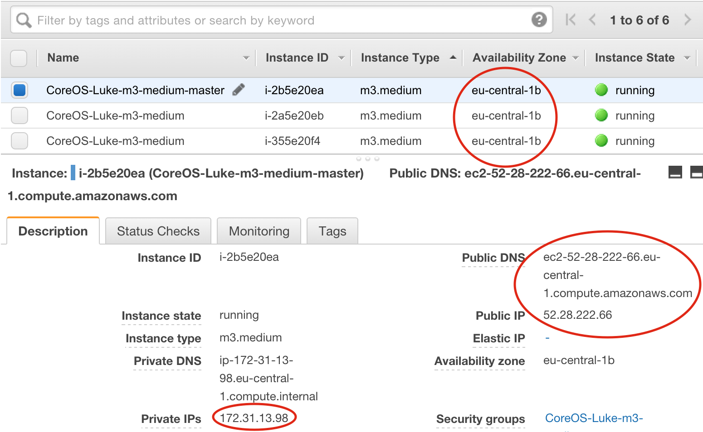

.. _labs-installer:

=========
Installer
=========

This document guides you through setting up a Flocker cluster and gives the simplest example of deploying and moving around some stateful containers.

Key points
==========

* Flocker is a clustered container data volume manager.
  This means it runs on a cluster (a group) of machines, and connects containers to data volumes so that containers which store data, such as databases, keep their data as they move around the cluster.
* Flocker is installed on servers, which you must provision, for example on cloud infrastructure.
* It works with other container tools, such as Swarm, Compose and Mesos/Marathon.

Architecture
============

This diagram shows you what you are about to set up.

.. image:: install-architecture.png

.. Source file is at "Engineering/Labs/flocker architecture" https://drive.google.com/open?id=0B3gop2KayxkVbmNBR2Jrbk0zYmM

* Installer runs in a Docker container on your local machine.
* You provision the servers yourself, then write a ``cluster.yml`` in your cluster directory containing the addresses of the servers.
* You run the installer on the ``cluster.yml``.
* Installer creates certificates for you, saves them in your cluster directory, installs Flocker and certificates on servers, and starts Flocker.
* You can now interact with your Flocker cluster using the Flocker CLI (included in same container as installer).

Supported Configurations
========================

The Installer can be used in the following configurations.

* **Supported configurations**

  * Ubuntu 14.04 on AWS with EBS backend
  * Ubuntu 14.04 on Rackspace with OpenStack backend
  * Ubuntu 14.04 on private OpenStack cloud with OpenStack backend

* **Experimental configurations**

  * CoreOS on AWS with EBS backend
  * Ubuntu 14.04 on any infrastructure with ZFS backend

Other configurations may work, but have not been tested.

.. _labs-installing-unofficial-flocker-tools:

Installing the Installer
========================

First we install the installer on your workstation.
This will work on Linux or OS X machines with Docker installed.

* If you don't have Docker installed, install it now (`Mac <https://docs.docker.com/mac/started/>`_, `Linux <https://docs.docker.com/linux/started/>`_).
* Then install the installer:

  .. prompt:: bash $

      curl -sSL https://get.flocker.io/ | sudo sh

  This installer is a tiny script which puts some wrapper scripts (around ``docker run`` commands) into your ``/usr/local/bin``.

* Now test one of the installed tools.

  .. prompt:: bash $

      uft-flocker-ca --version

  This should return something like ``1.2.0``, showing you which version of the Flocker Client is installed.

.. _labs-installer-certs-directory:

Make a local directory for your cluster files
=============================================

The tools will create some configuration files and certificate files for your cluster.
It is convenient to keep these in a directory, so let's make a directory on your workstation like this:

.. prompt:: bash $

    mkdir -p ~/clusters/test
    cd ~/clusters/test

Later on we'll put some files in this directory.

Get some nodes
==============

So now let's use the tools we've just installed to deploy and configure a Flocker cluster quickly!

Provision some machines on AWS or an OpenStack deployment (e.g. Rackspace or a private cloud), or bare metal if you want to try out the experimental ZFS backend.
Use Ubuntu 14.04 or CoreOS.

If using CoreOS, you can use `this CloudFormation template <https://raw.githubusercontent.com/ClusterHQ/flocker-coreos/master/coreos-stable-hvm.template>`_ to deploy an appropriate CoreOS cluster.

* This is a modified version of the CoreOS CloudFormation template which puts all the nodes in the same AZ (necessary so that they can access the same storage).
* It also gives the nodes 50GB root disks, useful for storing Docker images.
* It also opens up port 4523 for the Flocker API and port 80 and 443 for web traffic for the demo.

.. warning::
    CoreOS support is experimental, and should not be used for production workloads.
    ZFS support is similarly experimental.

Make sure you create the servers a reasonable amount of disk space, since Docker images will be stored on the VM root disk itself.

* Use Amazon EC2 if you want to use the EBS backend.
  **VMs must be deployed in the same AZ.**
* Use an OpenStack deployment (e.g. Rackspace, private cloud) if you want to try the OpenStack backend.
  **VMs must be deployed in the same region.**

You may want to pick a node to be the control node and give it a DNS name (if you do this, set up an A record for it with your DNS provider).
Using a DNS name is optional, you can also just use its IP address.

.. warning::
    On AWS, you also need to add a firewall rule allowing traffic for TCP port 4523 and 4524, plus any ports you want to access (the demo later uses port 80).

cluster.yml
===========

Run the following command in your ``~/clusters/test`` directory you made earlier:

.. prompt:: bash $

    uft-flocker-sample-files

This will create some sample configuration files that correspond to the backend Flocker will use - base your ``cluster.yml`` on one of these files:

* AWS EBS: ``cluster.yml.ebs.sample``
* OpenStack (including Rackspace): ``cluster.yml.openstack.sample``
* ZFS (local storage): ``cluster.yml.zfs.sample``

.. warning::
    Note that ZFS support is experimental, and should not be used for production workloads.

Choose the one that's appropriate for you, and then customize it with your choice of text editor.
For example:

.. prompt:: bash $

    mv cluster.yml.ebs.sample cluster.yml
    vim cluster.yml # customize for your cluster

If using AWS, you need to copy the following information into your ``cluster.yml``:

.. note::

    You need a private key which can log into the machines - you can configure this in the ``private_key_path`` of ``cluster.yml``.

Install Flocker
===============

From the directory where your ``cluster.yml`` file is now, run the following command:

.. prompt:: bash $

    uft-flocker-install cluster.yml

This will install the OS packages on your nodes required to run Flocker.
Flocker is not ready to run yet, we still need to do some certificate management.

Configure Certificates
======================

From the directory where your ``cluster.yml`` file is now, run the following command:

.. prompt:: bash $

    uft-flocker-config cluster.yml

This will configure certificates, push them to your nodes, and set up firewall rules for the control service.

Install Flocker Docker plugin
=============================

The Flocker Docker plugin allows you to use Flocker directly from the Docker CLI.

From the directory where your ``cluster.yml`` file is now, run the following command:

.. prompt:: bash $

    uft-flocker-plugin-install cluster.yml

Check that Flocker cluster is active
====================================

Try the Flocker CLI to check that all your nodes came up:

.. prompt:: bash $

    uft-flocker-volumes list-nodes
    uft-flocker-volumes list

You can see that there are no volumes yet.

Deploy and migrate a stateful app
=================================

Now you will deploy a highly sophisticated stateful app to test out Flocker.
In this example, ``demo`` is the name of the Flocker volume being created, which will map onto the Flocker volume being created.

.. prompt:: bash $

    $ NODE1="<node 1 public IP>"
    $ NODE2="<node 2 public IP>"
    $ KEY="<path on your machine to your .pem file>"
    $ ssh -i $KEY root@$NODE1 /root/bin/docker run -d -v demo:/data --volume-driver=flocker --name=redis redis:latest
    $ ssh -i $KEY root@$NODE1 /root/bin/docker run -d -e USE_REDIS_HOST=redis --link redis:redis -p 80:80 --name=app binocarlos/moby-counter:latest
    $ uft-flocker-volumes list

This may take up to a minute since Flocker is provisioning and attaching an volume from the storage backend for the Flocker ``demo`` volume.
At the end you should see the volume created and attached to the first node.

Now visit http://``<node 1 public IP>``/ and click around to add some Moby Docks to the screen.
Now let's stop the containers, then start the stateful app on another node in the cluster.

.. prompt:: bash $

    $ ssh -i $KEY root@$NODE1 /root/bin/docker rm -f app
    $ ssh -i $KEY root@$NODE1 /root/bin/docker rm -f redis
    $ ssh -i $KEY root@$NODE2 /root/bin/docker run -d -v demo:/data --volume-driver=flocker --name=redis redis:latest
    $ ssh -i $KEY root@$NODE2 /root/bin/docker run -d -e USE_REDIS_HOST=redis --link redis:redis -p 80:80 --name=app binocarlos/moby-counter:latest
    $ uft-flocker-volumes list

At the end you should see the volume has moved to the second node.

This may take up to a minute since Flocker is ensuring the volume is on the second host before starting the container.

Now visit http://``<node 2 public IP>``/ and you’ll see that the location of the Moby Docks has been preserved.
Nice.

Further reading
===============

Now that you've installed your own Flocker cluster, you may want to check out the experimental :ref:`volumes CLI <labs-volumes-cli>` and :ref:`GUI <labs-volumes-gui>`, and the :ref:`Swarm <labs-swarm>` and :ref:`Compose <labs-compose>` integrations.
