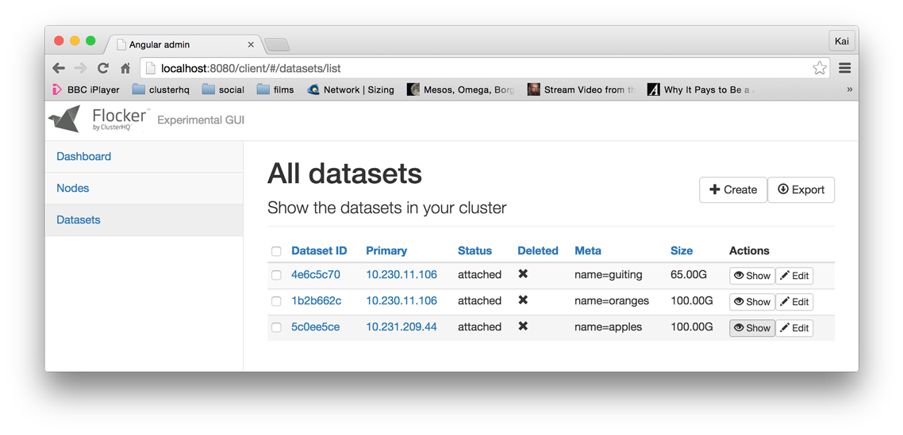

.. _labs-volumes-gui:

=====================
Prototype Volumes GUI
=====================

This is a very simple web interface to view the current state of the datasets (volumes) in your Flocker cluster.

You can also create volumes with sizes and metadata, and move datasets around between hosts by changing their primary.

Trying out the volumes GUI
==========================

Prerequisites:

* A Flocker cluster, if you don't have one of these then try the :ref:`experimental installer <labs-installer>`.
* Docker (either locally or in `boot2docker <https://docs.docker.com/installation/mac/>`_ on OS X).
* A web browser (tested on Google Chrome).

Step 1 - run the container with your local keys
===============================================

Run this command from the directory where you created your cluster configuration and certificates, for example ``~/clusters/test``:

.. prompt:: bash $

    cd ~/clusters/test
    export CERTS=$PWD
    export CONTROL_SERVICE=your.control.service
    export USERNAME=certuser
    docker run --name experimental-volumes-gui \
        -d -p 80:80 \
        -e CONTROL_SERVICE=$CONTROL_SERVICE \
        -e USERNAME=user \
        -e CERTS_PATH=/ \
        -v $CERTS/$USERNAME.key:/user.key \
        -v $CERTS/$USERNAME.crt:/user.crt \
        -v $CERTS/cluster.crt:/cluster.crt \
        clusterhq/experimental-volumes-gui

.. warning::

    You must substitute ``your.control.service`` with the name (or IP address, depending on how you configured it) of your control service and ``certuser`` with the name of an API user you generated a key and certificate for (where you have those files in your current working directory).
    Refer to the instructions in the :ref:`experimental installer <labs-installer>`.

Step 2 - load up the experimental Flocker GUI
=============================================

Go to `http://localhost/client/#/nodes/list <http://localhost/client/#/nodes/list>`_ or, if you are using ``boot2docker``:

.. prompt:: bash $

    open http://$(boot2docker ip)/client/#/nodes/list

Step 3
======

There is no step 3.
