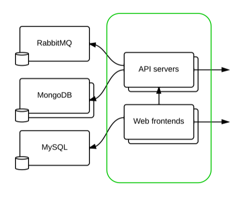
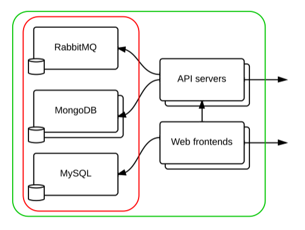
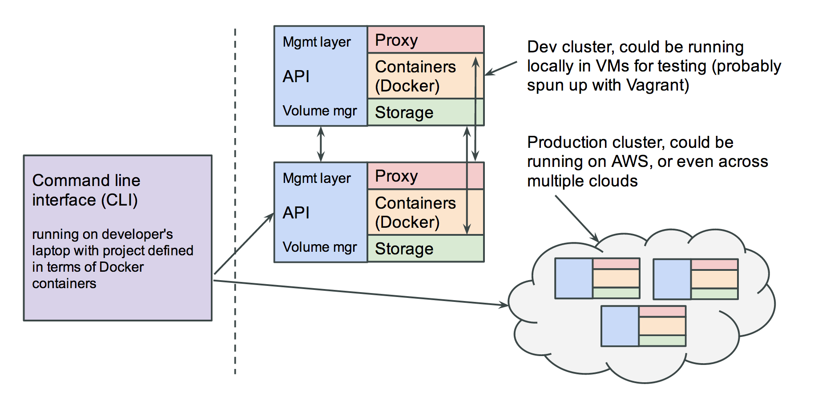

# Data focused Docker clustering
*or, what we learned from building HybridCluster and how it helps solve the data problem for clusters of stateful Docker containers.*

This document is intended to start a conversation about how Docker should handle volumes for distributed applications.
Without being able to run data-backed services reliably inside containers, containers will not be able to replace VMs for a large class of workloads.
Support for portable and resilient volumes is a currently a major missing piece of the puzzle for Docker to be able to provide a complete solution for many classes of applications in production.
We intend to fix this.

# Background

Here at [ClusterHQ](https://clusterhq.com/), we've learned a lot about data focused management of containers from our work on [HybridCluster](http://www.hybridcluster.com/), which is a distributed hosting platform on FreeBSD which gives each website, database & mailbox its own container (with a prototypical Docker-like template system) and a replicated ZFS volume with some neat features like HA (failover), automatic vertical scaling through live-migration and time machine-like snapshot and rollback functionality.

We are now transferring our knowledge on how to handle data focused container management into our new [Flocker](https://github.com/clusterhq/flocker) project, which builds on top of Docker on Linux to provide simple-to-use clustering of both stateful and stateless application components, such as databases, queues and key-value stores as well as application components.

**NB: Flocker currently implements only a small subset of what is described in this document.
This document is a request for comments from the community on how we plan to go about porting this capability to Docker.**

## Motivation

As people who care about ops as well as dev, there are some specific things we want our production systems to do:

* be robust and be able to cope with things failing.
* enable applications and their data services to automatically scale.
* eliminate single points of failure in our architectures, even where those single points of failure are whole data centers or cloud providers.
* reduce total costs of ownership and reduce the complexity of the platforms we're deploying/building so we can manage them more easily.

Hidden inside these requirements are some really hard computer science problems.

Current PaaS platforms and container frameworks [don't yet handle](http://blog.lusis.org/blog/2014/06/14/paas-for-realists/) these requirements [very well](http://blog.lusis.org/blog/2014/06/22/feedback-on-paas-realism/).
In particular, the current approach to both PaaS and containers is to [punt the hard problem of data management out to "services"](http://12factor.net), which either ends up tying us in to a specific cloud provider, or forces the data services to get managed orthogonally to the stateless application tier in an old-fashioned way.

What's more, having different data services in test, dev and production means that we violate the principle we're working hard to establish as a community: real consistency of execution environments across dev, test and production.

We believe the concept of the application should *include* its dependent data services, because they are an integral part of their execution envrionment.

The status quo &mdash; with data services in one silo, and the scalable app tier in another &mdash; is a radically sub-optimal solution.

It's possible to develop something more like Google's distributed data management layer which we believe should become embedded firmly within our container platforms ("orchestration frameworks"), in order to capture both the stateful data tier (left) and the stateless app tiers (right) in our applications.

**What Docker and container management can capture today:**

**What we ought to be able to capture and reliably deploy:**

To deliver on the promises of *infrastructure as code*, and *portability of entire applications* we need a way of safely and consistently managing the stateful as well as the stateless components of our apps in an ops-friendly way, across dev, staging and production environments.

What's more, in a cloud infrastructure world (as opposed to with enterprise virtualization) it's necessary to do this with unreliable instances and effectively ephemeral "local" storage (EBS volumes have a failure rate which at scale you have to plan for, and shared storage e.g. NFS doesn't work well in the cloud).

Becoming more our agile with our data might also give us other benefits, such as being able to easily clone a production database for use in a staging environment, or very cheaply clone 10 copies of a staging environment for our users.

What follows is a concrete proposal on how to build a data-focused cluster management platform for containers, based on our experience building HybridCluster.

## Naming

Just a point on naming and context assumptions:

* **Every process is a service.**
  Some processes depend on container-local state and some don't, but throughout the rest of this document we'll call every process running in a container (be it a stateless API server, or a Mongo shard server) a service.
* **Every service runs in a container.**
  We're assuming that every service runs in a Docker container, with one or more attached volumes for mutable state, if any.

## Goals

Let's assume we're trying to build a system with the following properties:

* **Multi-node/clustered.**
  * Interesting applications (made up of multiple containers) typically run on multiple servers, either for performance or reliability reasons.
  * We therefore need to tackle multiple servers and the distributed systems complexity that comes with that.
* **Ease of operational manageability.**
  The system should be *simple* in the sense that it should not consist of many specialised components that require individual expertise to manage.
  This has at least the following consequences:
  * **Homogeneous servers.**
    * Each server in the cluster should be *functionally identical* so that no one server is ever considered to be special.
    * Functionally identical in this sense means that any server could run any container or be hosting any volume.
  * **No single point of failure.**
    * Any server should be able to fail at any time, and the system should be as self-healing as possible.
    * The cluster should aim to make unreliable underlying infrastructure reliable.
  * **Multi-region.**
    * To truly eliminate single points of failure, the system needs to be able to span multiple data centers or cloud providers.
      This has implications on networking as well as volume replication characteristics.
  * **Any data services the system depends on must be protected by/within the system itself.**
    * In order to achieve *operational manageability for the people running these systems* any state stored by the cluster itself should be stored within the cluster, and the cluster should not depend on any external services beyond its constituant (unreliable) network, compute & local storage.
* **Containers should be portable, even when they have state.**
  * It should be possible to easily, transparently and seamlessly move containers around along with their respective data around between servers in the cluster while in production *without losing any requests*.
  * This is essential from an ops perspective so that, while we care about our data services and treat them like pets, we shouldn't have to care about our individual servers, and should be able to treat them as cattle.
  * Example use cases for moving containers off a server are if that server is too busy, is about to be shut down, or needs to have its RAM upgraded.
* **Dependent services or applications should not need to be reconfigured when a service moves around.**
  * Moving a service from one node to another should not impact requests either internal to the cluster (from other services or applications) or external requests.
  * No services should need to be restarted when something moves (except for possibly the service being moved - but that should be transparent to the rest of the system).
* **The system should expose portable, resilient volumes.**
  * It should be the platform's responsibility to provide portable, resilient volumes.
  * That means that any application (such as a database or email server) in a container should be able to persist changes to a local filesystem volume, and have those changes automatically replicated to a configurable number of replicas in the same data center, and a configurable number of replicas in a remote data center.
  * It should be possible to migrate that volume seamlessly (with no data loss) between different nodes in the cluster.
* **Filesystem replication is asynchronous and therefore has an associated replication latency.**
  * Synchronous replication should be an application-level construct where necessary, not a platform-level construct.
  * If an application (such as a database) requires synchronous replication, it should be configured to implement that itself.
  * It is not performant to deliver synchronous POSIX filesystem replication on commodity (cloud) infrastructure across multiple regions.
  * Automated failover must then be configurable within these constraints.
    In other words it might not be acceptable to automatically fail over a production database to the filesystem replica.
    Instead important transactional applications should use their own guarantees for consistency.
    Filesystem replication is still useful for enabling volume portability (live migration) and for resilience for applications that can tolerate looser consistency constraints (e.g. 30 second replication latency).
* **Stateful things scale vertically, stateless things scale horizontally.**
  * Each volume can only be sensibly mounted in one place at a time.
  * Each container with state can therefore only be *running* in once place at a time.
  * Stateless containers can be running many times, and have requests distributed across them in a round-robin fashion.
  * Note that while *individual* stateful containers can only be running in one place at a time, and therefore must scale vertically (i.e., by the cluster dynamically moving them around), this does not preclude distributed databases such as MongoDB or Galera from running across multiple containers, and implementing horizontal data scalability at the application level.

## One way to implement these goals

The following is an overview of one implementation approach to achieve these goals.

### Diagram

A cluster consists of two or more servers (nodes).
For example the two large colourful boxes in this diagram are a cluster of two nodes.
The three smaller boxes in the cloud are a second cluster of three nodes.

Each node is a Docker host, has local storage, and also has a proxy layer (more on this later).

There is management software running on each machine.
The management software on each node communicates with the management software running on the other nodes in the same cluster.

### Management layer

The management layer (blue box in the diagram) is a daemon which runs on each node in the cluster.
It connects all the nodes up together in a group and allows them to make co-operative decisions.

It does this with no single master using distributed consensus protocols.

In HybridCluster we initially used the [Spread toolkit](http://www.spread.org/) to implement group messaging between all nodes in the cluster but we ended up rewriting it due to poor performance in production.

In Flocker we are likely to use [Zookeeper](http://zookeeper.apache.org/) to provide strongly consistent group membership semantics.

The management layer allows all the nodes in the cluster to be aware of which other ones are present on the network.
It also allows the nodes to pass messages around to co-ordinate distributed actions such as filesystem replication and live migration events.

It also allows all the nodes to know which other nodes are hosting which containers, which is important for the networking configuration.

Note that this does not rely on any external data services.
In HybridCluster we used Redis for storing data *local* to each node.

### Storage

Each container has zero or more volumes attached to it.
Each volume corresponds to a [ZFS](http://open-zfs.org/) filesystem, allocated from a local ZFS pool.

ZFS filesystems are the perfect storage analogue to containers for compute: they are lightweight and enable portability.
You can allocate thousands of ZFS filesystems out of a local pool, and they all share the available space.
They also provide guaranteed data integrity, solving the "bit rot" problem.

The really interesting thing about ZFS volumes is that they can be independently snapshotted and replicated.
This means that the storage backend for one container which is running on one server in a master role can be continuously snapshotted and replicated to other nodes, even in another data center.

Then by the management layer can respond to a change in group membership, for example the cluster can recover from a server failing and automatically recover all the containers along with *very recent* copies of their data onto one of the replicas elsewhere in the cluster.

In other words, this allows us to define a configurable redundancy invariant across local and remote nodes in a globally distributed cluster.

The system automatically allocates slaves for a master volume on demand.
For example, this allows us to configure continuous replication for N local replicas and M remote replicas for an off-site backup.

### Networking

In HybridCluster we implemented a proxy called AwesomeProxy.
This is a userland proxy which binds to all the interesting public ports on each node and understands just enough of each supported layer-7 protocol (HTTP, HTTPS, MySQL, SSH, FTP, POP, IMAP & SMTP) to figure out how where to route any request.

This means the system acted like a true distributed system in the sense that you could send any request for any application/database to any node and it would be correctly reverse-proxied to the correct backend.

This means that, for example with a website, you can just publish the addresses of all your cluster nodes as A records in DNS, and you get reasonably good failover for free from most modern HTTP clients.

Another key function of the proxy is that it allows incoming connections to be momentarily paused during a live migration and to automatically and seamlessly re-route incoming requests.

In Flocker, we decided to bake in the distinction between *routes* and *links*, which reduces the need to support things like the MySQL binary protocol for intra-cluster communication.

* Routes are addresses of *public* services, for example: `(http, "mysite.com")`.
  This requires the proxy layer to be smart enough to route based on a `Host` header or equivalent for whichever external protocols we want to support.
* Links are internal connections between containers, which are simply TCP connections.
  For example, port 3306 inside an application container can route via some dynamically configured ephemeral ports to port 3306 inside a MySQL container, and that multiple links can exist on the same port mappings for different containers.

We plan to eventually support pausing and live migrating both types of connections.

### Live migration

By manipulating the storage layer and the networking layer simultaneously, the management layer can seamlessly migrate stateful containers between servers, and even between data centers, all without a single failed request.

Recall that all volumes are continuously replicated to a configurable number of other machines in the cluster.
Assuming you wish to live migrate a container and its volume from one server to another which is already a slave for that volume, we can do in seconds by:

* pausing new incoming requests at the proxy layer
* allowing in-flight requests to complete
* shutting down the container so the filesystem becomes quiescent
* taking a final snapshot of the volume
* replicating the (typically) last few hundred kilobytes of data from the sending machine to the receiving machine
* starting the container on the receiving machine
* once it's booted, unleashing the requests that were building up at the sending machine

This enables a seamless migration of any software which is receiving short-lived requests from one server to another.
Due to the way the networking setup works, you can even seamlessly migrate the stateful container between cloud providers.

### Coming soon

* Auto juggling
* Shedding containers from a node
* Locality preferences
* Time machine
* Cloning

## Feedback

Please send comments on this document to [luke@clusterhq.com](mailto:luke@clusterhq.com) or join `#clusterhq` on Freenode!
