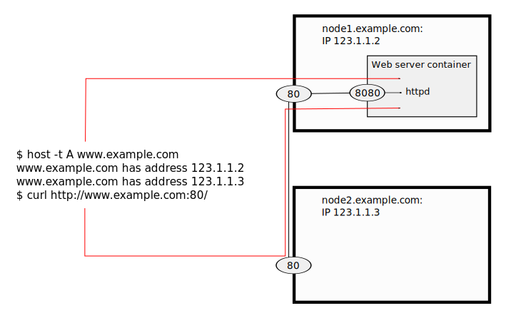

External Routing
================

``www.example.com`` has a DNS record pointing at two different nodes.
If you connect to port 80 on the node not hosting the container the traffic will be routed on to the correct node.
Moving the host where the container is hosted does not require updating DNS records.
